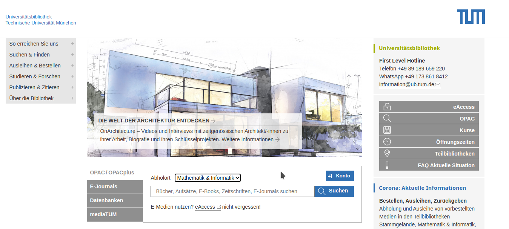

# 常用网站

## [TUM 官网](https://www.tum.de/)

## [TUM Online](https://campus.tum.de) 

学生个人信息主入口

## [Moodle](https://moodle.tum.de)

你将最常用的网站，包含课程资料。

## [图书馆网站](https://ub.tum.de)

图书管卡号在学生证背面，默认初始密码是 DDMM (如生日 4 月 19 日密码是 1904) 

## [ZHS](https://www.zhs-muenchen.de/zhs/startseite/)

ZHS 是 Zentraler Hochschulsport München 的缩写，英文是 University Sports Center Munich。

## [Google Scholar](https://scholar.google.com/)

下载论文、查看引用、学术前沿动向

## [Github](https://github.com/)

交友网站不解释¯\_(ツ)_/¯

## [Overleaf](https://www.overleaf.com/)

在线 LaTex 编辑平台，写论文神器！

## [Welcome2Munich](https://tumde.github.io/welcome2munich/#/)

本网站，一定要关注哦！
